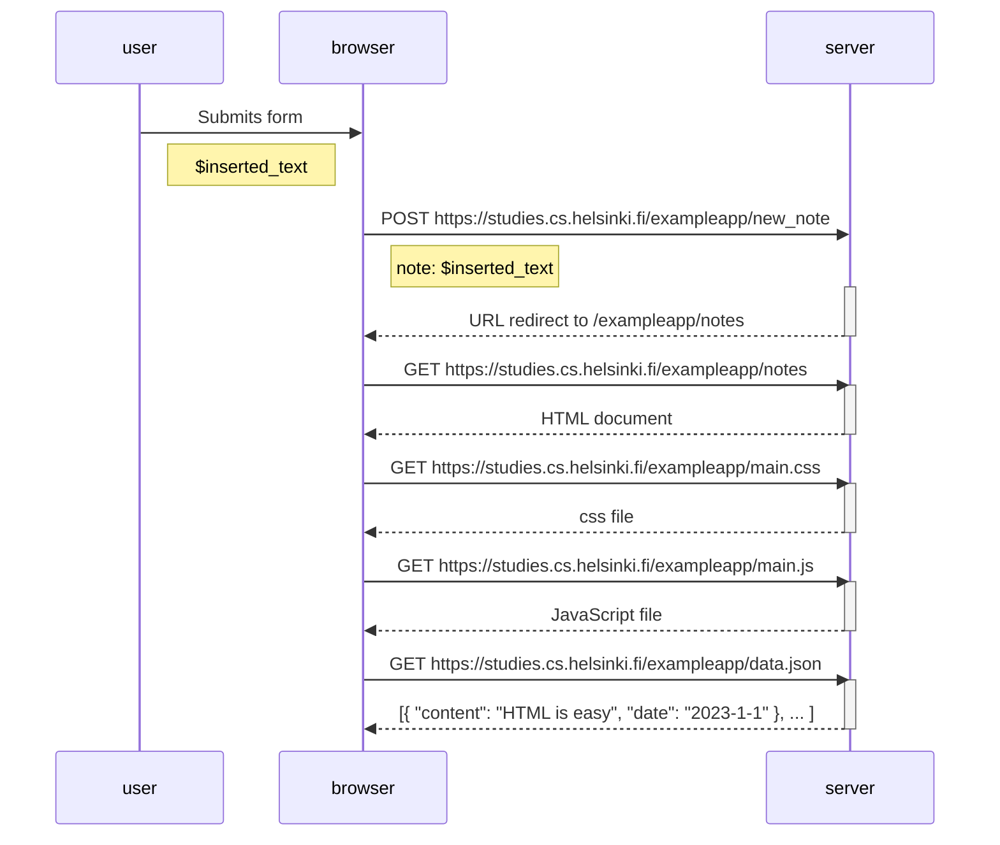

```mermaid
sequenceDiagram
    participant user 
    participant browser
    participant server

    user->>browser: Submits form
    Note right of user: $inserted_text
    
    browser->>server: POST https://studies.cs.helsinki.fi/exampleapp/new_note
    Note right of browser: note: $inserted_text
    activate server 
    server-->>browser: URL redirect to /exampleapp/notes
    deactivate server 

    browser->>server: GET https://studies.cs.helsinki.fi/exampleapp/notes
    activate server
    server-->>browser: HTML document
    deactivate server

    browser->>server: GET https://studies.cs.helsinki.fi/exampleapp/main.css
    activate server
    server-->>browser: css file
    deactivate server

    browser->>server: GET https://studies.cs.helsinki.fi/exampleapp/main.js
    activate server
    server-->>browser: JavaScript file
    deactivate server

    browser->>server: GET https://studies.cs.helsinki.fi/exampleapp/data.json
    activate server
    server-->>browser: [{ "content": "HTML is easy", "date": "2023-1-1" }, ... ]
    deactivate server
```
